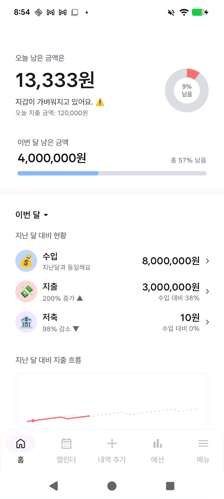
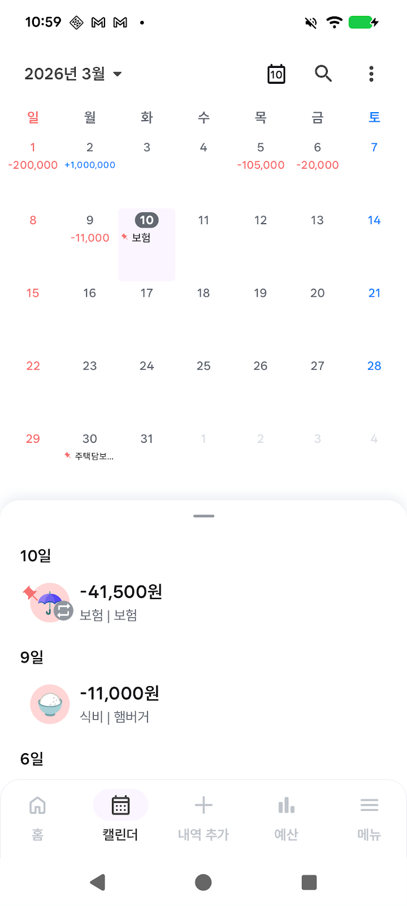
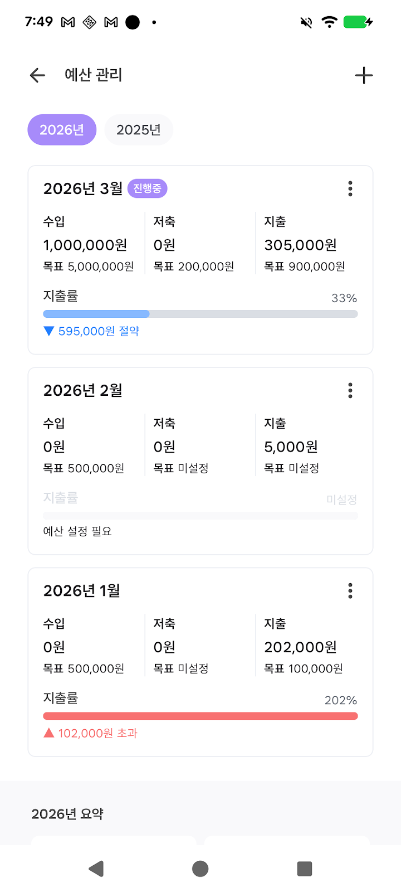
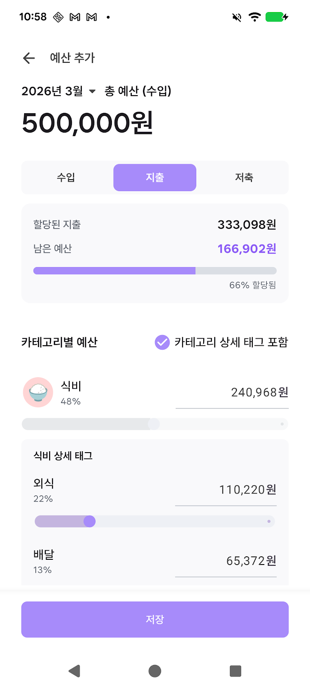
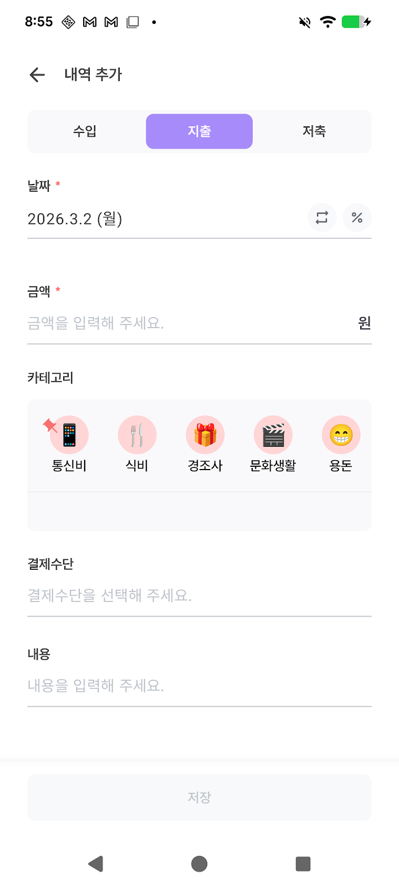
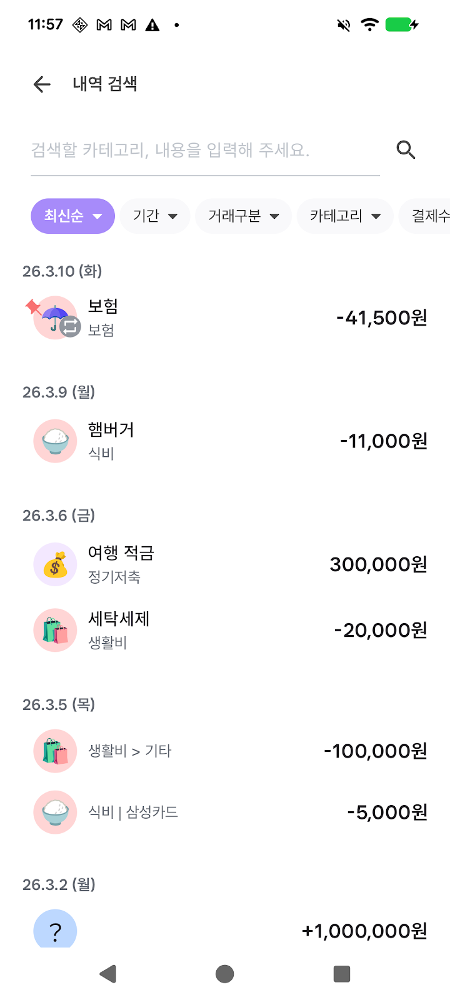
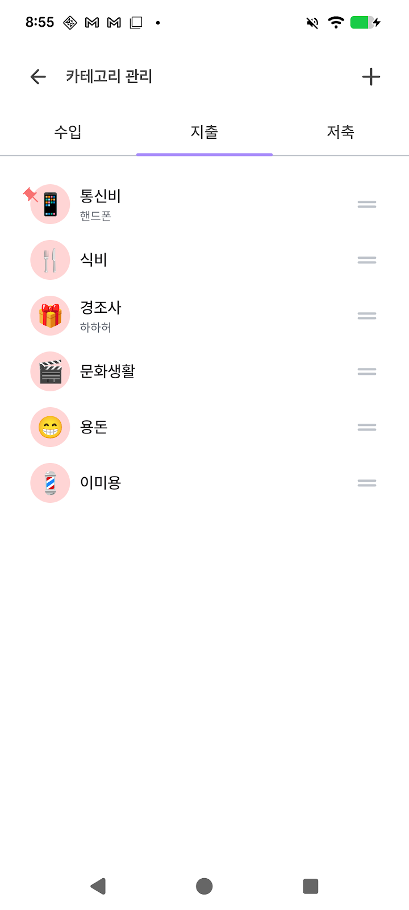

# WealthMate

> 수입·지출·예산을 한곳에서 관리하는 Kotlin Multiplatform 가계부 앱

WealthMate는 일상의 거래 내역을 기록·분류하고, 예산을 세워 지출을 관리하며, 데이터를 Google Drive로 백업·동기화하는 **개인 가계부 앱**입니다. Android와 iOS를 Compose Multiplatform으로 함께 지원합니다.

## 📱 스크린샷

| 홈 (대시보드) | 캘린더 | 예산 관리 |
|:---:|:---:|:---:|
|  |  |  |
| 오늘·이번 달 지출, 예산 대비 현황 | 날짜별 내역 + 월간 패턴 | 월별 예산·지출률·초과 추적 |

| 예산 추가 | 거래 추가 | 검색 |
|:---:|:---:|:---:|
|  |  |  |
| 카테고리별 예산 슬라이더·상세 태그 | 수입/지출/저축 입력, 반복·할부 | 기간·카테고리·결제수단 다중 필터 |

| 카테고리 관리 | 반복 설정 | 백업·복구 (Google Drive) |
|:---:|:---:|:---:|
|  |  |  |
| 카테고리·상세 태그 편집·정렬 | 고정 반복 거래 관리 | Google 로그인 + Drive 백업/복구 |

> Android · iOS 동일 코드베이스 (Kotlin Multiplatform + Compose Multiplatform)

## 소개

- **거래 기록** — 수입·지출·저축 내역을 카테고리·결제수단·날짜로 기록하고 편집합니다.
- **예산 관리** — 월별·카테고리별 예산을 세우고 사용액 대비 초과 여부를 추적합니다.
- **캘린더 & 통계** — 달력으로 일별 내역을 보고, 주·월·년 단위와 카테고리·결제수단별로 지출을 분석합니다.
- **검색** — 기간·카테고리·결제수단 필터와 정렬로 거래를 찾습니다.
- **동기화** — Google 로그인 후 Google Drive로 데이터베이스를 백업·복구하고, 공유 폴더로 여러 기기에서 함께 씁니다.

## 주요 기능

| 영역 | 내용 |
|------|------|
| 홈(Home) | 오늘/이번 달 지출, 예산 대비 현황, 기간별(주·월·년) 추이, 카테고리·결제수단 분석, 고정 반복 거래 |
| 캘린더(Calendar) | 날짜별 거래 조회, 수입/지출/저축 필터, 월간 패턴 시각화 |
| 예산(Budget) | 월별·카테고리별 예산 설정, 초과 판단, 상위 지출 항목, 상세 보기 |
| 검색(Search) | 키워드·기간·카테고리·결제수단 다중 필터 + 정렬, 결과 요약 |
| 거래 추가 | 금액·카테고리·결제수단 입력, 반복 거래·할부 설정 |
| 메뉴(Menu) | Google 로그인, 데이터 관리/설정 |

## 기술 스택

- **Kotlin Multiplatform** 2.3.0 — Android / iOS 코드 공유
- **Compose Multiplatform** 1.10.0 + Material 3 — 공용 UI
- **Voyager** 1.1.0-beta03 — 네비게이션 (ScreenModel)
- **Koin** 4.1.1 — 의존성 주입
- **Room** 2.8.4 (+ androidx.sqlite) — 로컬 SQLite 데이터베이스
- **Ktor Client** 3.4.0 — Google Drive API 연동
- **KmpAuth** — Google OAuth 인증
- **Multiplatform Settings** — 키-값 저장(토큰 등)
- **kotlinx** — Coroutines / Serialization / DateTime / Collections-Immutable
- **Compottie** — Lottie 애니메이션 · **Napier** — 로깅 · **uuid4** — ID 생성

전체 버전은 [`gradle/libs.versions.toml`](gradle/libs.versions.toml) 참고.

## 아키텍처

### 모듈 구성

| 모듈 | 역할 |
|------|------|
| `:composeApp` | 공용 UI 레이어 (Android · iOS). `feature/`(home·budget·calendar·search·menu), `base/`(MVI), `vo/`(UI 모델), `theme/`, `di/` |
| `:shared` | 도메인·데이터 레이어. `database/`(Room Entity·DAO), `repository/`, `usecase/`, `network/`(Google Drive), `di/` |
| `:server` | KMP 프로젝트 템플릿의 기본 모듈. 현재 제품에서는 사용하지 않음 |
| `iosApp` | iOS 진입점 (Xcode 프로젝트) |

### MVI 패턴

화면은 `Screen` / `Contract`(UiState·UiSideEffect) / `ScreenModel`(Voyager) 로 구성되며, `base/BaseScreenModel`의 `Container`가 상태와 일회성 이펙트를 관리합니다.

- `UiState` → `StateFlow`로 구독, Compose가 자동 재구성
- `UiSideEffect` → 일회성 이벤트(스낵바·키보드·네비게이션)
- `reduceState { }` / `postSideEffect()` / `launchSafe { }`(에러·로딩 처리)

### 데이터

- **로컬**: Room(SQLite) — 거래(History)·예산(Budget)·카테고리·결제수단·반복거래·할부 엔티티
- **동기화/인증**: Google OAuth(KmpAuth) + Google Drive(Ktor Client) — 백업/복구 및 공유 폴더 동기화
- **설정**: Multiplatform Settings
- 저장소 인터페이스를 `:shared`에 두고 플랫폼별 구현을 Koin `platformModule`에서 주입합니다.

### 플랫폼 분기 (expect/actual)

`DatabaseBuilder` · `DatabaseManager` · `Settings` · Google 로그인 등이 Android / iOS 별로 분리되어 있습니다.

## 프로젝트 구조

```
WealthMate/
├── composeApp/      # Compose Multiplatform UI (Android · iOS)
│   └── commonMain/  # feature, base(MVI), vo, theme, di
├── shared/          # 데이터·도메인
│   └── commonMain/  # database(Room), repository, usecase, network, di
├── server/          # KMP 템플릿 모듈 (미사용)
├── iosApp/          # Xcode 프로젝트
└── gradle/          # 버전 카탈로그(libs.versions.toml)
```

## 시작하기

### 요구 사항

- Android Studio (최신), JDK 17+
- Xcode (iOS 빌드 시)
- **Google OAuth 클라이언트 ID** — Google 로그인 / Drive 동기화에 필요 (Google Cloud 콘솔에서 발급해 설정)

### Android 실행

```shell
./gradlew :composeApp:assembleDebug      # APK 빌드
./gradlew :composeApp:installDebug       # 연결된 기기/에뮬레이터에 설치
```

- `applicationId` / `namespace`: `com.jie.wealthmate`
- minSdk 30 · targetSdk 36 · compileSdk 36

### iOS 실행

`iosApp` 디렉토리를 Xcode에서 열어 실행합니다. (타깃: iosArm64 / iosSimulatorArm64)

## 화면 흐름

```
Home (대시보드·통계)
Calendar (일별 내역)
Budget (예산 설정·추적)
Search (필터 검색)
Menu (로그인·설정)
  └─ 거래 추가/편집 (금액·카테고리·결제수단·반복·할부)
```

---

기본 브랜치: `develop` · 패키지: `com.jie.wealthmate`
